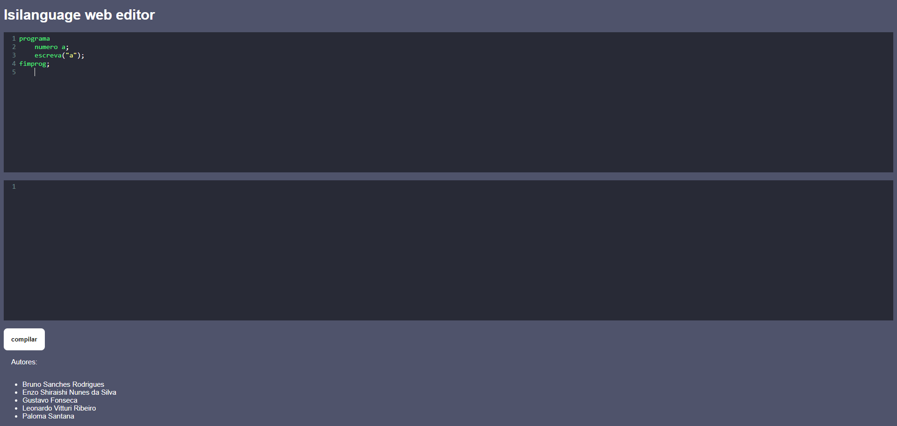

# Isilanguage_2022.2

>❗ **ATENÇÃO** ❗
>
> Professor, por favor veja a versão desse repositório disponível em https://github.com/eshiraishi/isilanguage, pois conta com os itens de desenvolvimento web dos elementos extraordinários.

> Acesse o [editor web online](https://brusangues.github.io/isilanguage-front/)



## Integrantes do Projeto

| NOME                          |          RA |
| :---------------------------- | ----------: |
| Bruno Sanches Rodrigues       | 11201721076 |
| Enzo Shiraishi Nunes da Silva | 11201822545 |
| Gustavo Fonseca               | 11201921803 |
| Leonardo Vitturi Ribeiro      | 11201722342 |
| Paloma Santana                | 11201921396 |

## Checklist

### Requisitos Mínimos

- [X] Possuir 2 tipos de dados (pelo menos 1 String)  
- [X] Possuir a instrução de decisão (if/else)
- [X] Pelo menos 1 estrutura de repetição
- [X] Verificar Atribuições com compatibilidade de tipos (semântica)  
- [X] Possuir operações de Entrada e Saída
- [X] Aceitar números decimais  
- [X] Verificar declaração de variáveis (não usar variáveis que não foram declaradas)
- [X] Verificar se há variáveis declaradas e não-utilizadas (warning)
- [X] Geração de pelo menos 1 linguagem destino (C/Java/Python)

### Anexo 1 - Elementos Adicionais

- [ ] Nova instrução para Switch/Case (escolha/caso)
- [X] Mais tipos de dados
- [X] Inclusão de novos operadores (exponenciação, raiz quadrada, logaritmos)
- [ ] Geração de código para mais de uma linguagem diferente

### Anexo 2 - Elementos Extraordinarios (pelo menos 2 itens abaixo)

- [ ] Criar um interpretador a partir da AST
- [ ] Criar um editor com Highlights de palavras reservadas (editor Desktop)
- [X] Criar um editor Web para o código
- [X] Tornar o compilador um Webservice para receber programas e enviar respostas de possíveis erros

## Comandos úteis

### Compilar o parser / recognizer a partir do arquivo .g4

```shell
java -cp .:antlr-4.7.1-complete.jar org.antlr.v4.Tool IsiLang.g4 -package parser -o ./src/parser/
```
